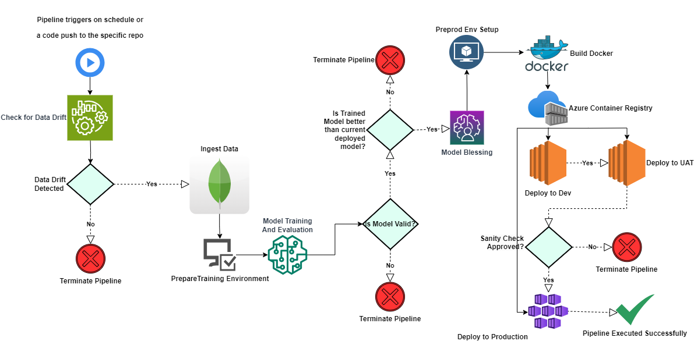
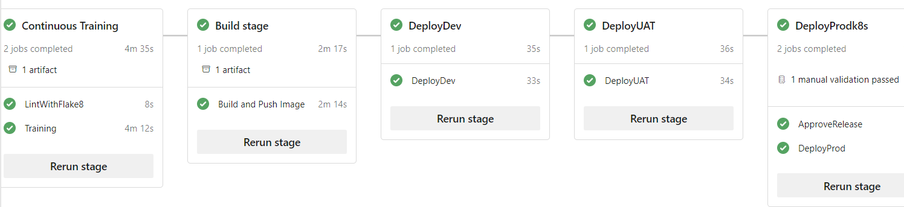

<p align="center">
    <b>
        <h1 align="center">IoT Device Identification</h1>
    </b>
</p>
<p align="center">
<a href="https://github.com/Hassi34/iot-device-identification">
    
</a>
</p>
<p align="center">
<a href="https://github.com/Hassi34/iot-device-identification">
    
</a>
</p>

<p align="center">
    <a href="https://www.python.org/downloads/">
        
    </a>
    <a href="https://github.com/Hassi34/iot-device-identification">
        
    </a>
    <a href="https://github.com/Hassi34/iot-device-identification">
        
    </a>
    <a href="https://github.com/Hassi34/iot-device-identification">
        
    </a>
    <a href="https://github.com/Hassi34/iot-device-identification/blob/main/LICENSE">
        
    </a>
    <a href="https://github.com/hassi34/iot-device-identification/issues">
        
    </a>
    <a href="https://github.com/hassi34/iot-device-identification/issues">
        
    </a>
</p>

Following are the main contents to follow, you can jump to any section:

>   -  [Introduction](#project-intro)<br>
>   -  [Project Notebooks](https://github.com/Hassi34/iot-device-identification/tree/notebooks)
>   -  [System Design](#sys-design)<br>
>      -  [CICD on Azure DevOps](#cicd-azdev)<br>
>      -  [Tech Stack](#tech-stack)<br>
>      -  [Infrastructure](#infra-)<br>
>      -  [ONNX Format](#onnx-format)<br>
>   -  [Run Locally](#run-local)<br>
>      - [Environment Setup](#env-setup)<br>
>      - [Environment Variables](#env-vars)<br>
>      - [Run Pipeline](#run-pipeline)
>   -  [Kubernetes Cluster Setup](#k8s-cluster)<br>
>      - [Create a secret for docker registry](#secret-docker)<br>
>      - [Ingress Controller Setup](#ingress-controller)<br>
>      - [How to call the api after deployment](#call-api)<br>
>   -  [Conclusion](#conclusion-)<br>

### Introduction<a id='project-intro'></a>

This project aims to detect and identify IoT devices that are connecting to a network to save us from multiple attacks. The project uses PyTorch for model training and evaluation. The model is trained only when data drift is detected. The data is ingested from a MongoDB database. The trained model is then pulled from the MLFlow artifact registry and compared with the current model in production. If the newly trained model is better than the currently deployed model, then it creates the ONNX format for the model and deploys the new model in production. All the experiments and run time logs are being tracked.

## System Design<a id='sys-design'></a>


### CICD on Azure DevOps<a id='cicd-azdev'></a>


### Tech Stack Used<a id='tech-stack'></a>
<pre>
1. Python 
2. Data Version Control (DVC) 
3. Docker
4. Machine learning algorithms
5. MLFlow
6. Cloud Computing
7. SMTP Server
</pre>
### Infrastructure<a id='infra-'></a>
This is an end-to-end project that involves continuous training, building images, deploying to dev, then to UAT, and then eventually to the production environment (AKS - Azure Kubernetes Services). The entire process is executed through a completely automated CICD pipeline on Azure DevOps, which presents an MLOps level 2 architecture design.
<pre>
1. Azure Container Registry (ACR)
2. MySQL Server
3. FastAPI 
4. GitHub
5. DaghsHub
6. Azure DevOps
7. EC2
8. Kubernetes (AKS)
</pre>
### ONNX Format<a id='onnx-format'></a>
The significance of creating the ONNX format for the model is that it allows the model to be deployed on different platforms and devices. ONNX is an open format that allows models to be trained in one framework and then used in another. It provides a standard for representing deep learning models that enables interoperability between different frameworks and tools.

## Run Locally<a id='run-local'></a>

* Ensure you have [Python 3.8+](https://www.python.org/downloads/) installed.

* Create a new Python Conda environment:<a id='env-setup'></a>

```bash
conda create -p venv python=3.11
conda activate ./venv 
```
OR
* Create a new Python virtual environment with pip:
```bash
virtualenv venv
source venv/Scripts/activate
```
Install dependencies

```bash
  pip install -r requirements.txt
```

Clone the project

```bash
  git clone https://github.com/Hassi34/iot-device-identification.git
```

Go to the project directory

```bash
  cd iot-device-identification
```

#### Export the environment variable<a id='env-vars'></a>
```bash
# MongoDB
MONGO_DB_URI=
MONGO_DATABASE_NAME=

# MLFlow
MLFLOW_TRACKING_URI=
MLFLOW_TRACKING_USERNAME=
MLFLOW_TRACKING_PASSWORD=

#Model Serving 
JWT_AUTH_SECRET_KEY=
JWT_AUTH_ALGORITHM=
# MySQL Database ( OAuth2 )
DB_HOST=
DB_NAME=
DB_USER=
DB_PASS=

# AWS Credentials
AWS_ACCESS_KEY_ID=
AWS_SECRET_ACCESS_KEY=
AWS_DEFAULT_REGION=
BUCKET_NAME=

```

Run Pipeline<a id='run-pipeline'></a>

```bash
  dvc repro
```
## Kubernetes Setup<a id='k8s-cluster'></a>
Provision a kubernetes cluster, in my case, I used Azure Kubernetes Service (AKS)<br>
### Create a secret for docker registry:<a id='secret-docker'></a>
For a private repository, make sure to create the secrets first by using the following command
```bash
kubectl create secret docker-registry regcred --docker-server=<your-registry-server> --docker-username=<your-name> --docker-password=<your-pword> --docker-email=<your-email>
```
Then you can reference it in your deployment.yaml file

### Ingress Controller Setup:<a id='ingress-controller'></a>
Here we will nginx ingress controller
```bash
helm repo add bitnami-azure https://marketplace.azurecr.io/helm/v1/repo
helm repo list
helm repo update
kubectl create ns ingress # create a new namespace for installing ingress controller
helm install my-ingress-release bitnami-azure/nginx-ingress-controller -n ingress
helm delete my-ingress-release # if you want to delete the ingress controller
```
Now check the service in ingress namespace, you should be able to find the external ip address
Search for that ip address in the portal, create a specific dns name for that 
update this newly created DNS adress in ingress.yaml file

### How to call the api after deployment:<a id='call-api'></a>
first get the access token
```bash
import requests

# URL of your authentication endpoint
url = "http://yourapi.com/auth/token"

# Your credentials and other required parameters
data = {
    "grant_type": "password",
    "username": "your_username",
    "password": "your_password",
    "scope": "your_scope",  # if required
    "client_id": "your_client_id",  # if required
    "client_secret": "your_client_secret"  # if required
}

response = requests.post(url, data=data)
if response.status_code == 200:
    access_token = response.json().get("access_token")
else:
    print(f"Failed to authenticate: {response.text}")

```
After that, pass the access token in the headers while making the request to the prediction service
```bash
import requests

# URL of your main API endpoint
url = "http://yourapi.com/predict/iot-devices"

# Your request data
data = {
    "request_data": {
        "ack_pkts": 28,
        "ack_r": 15,
        "bytes_A_B": 1355,
        "bytes_B_A": 1287,
        "bytes_A_B_rate10": 0.2337552086,
        # include other key-value pairs as required
    }
}

# Headers with the access token
headers = {
    "Authorization": f"Bearer {access_token}"
}

# Make the POST request
response = requests.post(url, json=data, headers=headers)

if response.status_code == 200:
    print(response.json())
else:
    print(f"Failed to make request: {response.text}")

```

## Conclusion<a id='conclusion-'></a>
This project is production ready for similar use cases and will provide the automated and orchestrated pipelines.
#### **👉🏻Thank you for visiting 🙏 Your feedback would be highly appreciated 💯😊**<br>
#### **👉🏻If you find this project useful then don't forget to star the repo ✨⭐🤖**<br>
#### 🌏[My Portfolio Website][website] <br><br>
#### **📃 License**
[MIT][license] © [Hasanain][website]

[license]: hhttps://github.com/Hassi34/iot-device-identification/blob/main/LICENSE
[website]: https://hasanain.aicaliber.com

Let's connect on **[``LinkedIn``](https://www.linkedin.com/in/hasanain-mehmood)** <br>